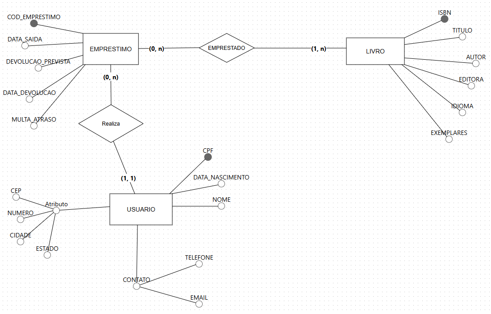
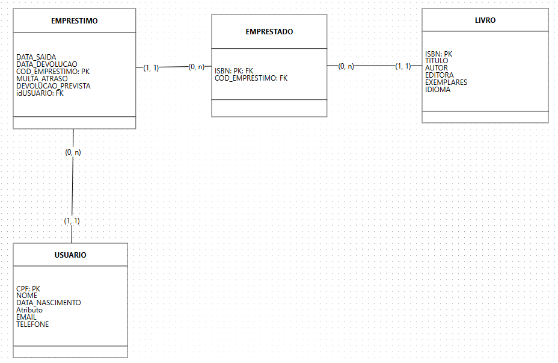

# Biblioteca de Livros

## Descrição

Este projeto é uma aplicação web para gerenciamento de uma biblioteca. Permite cadastrar clientes e livros, realizar empréstimos e calcular multas por atraso na devolução.

## Funcionalidades

* **Cadastro de Clientes:** Crie e edite registros de clientes, incluindo nome, CPF, endereço e telefone.
* **Cadastro de Livros:** Adicione, remova e gerencie o catálogo de livros, com informações como título, autor, ISBN e disponibilidade.
* **Empréstimos:** Registre empréstimos de livros para clientes, com data de empréstimo e previsão de devolução.
* **Devoluções:** Registre a devolução de livros e calcule multas por atraso.
* **Busca:** Realize buscas por clientes, livros e empréstimos por diversos critérios.

## Diagramas Conceituais e Lógicos

* **Modelo Conceitual**
	
	
* **Modelo Lógico**
	

## Tecnologias Utilizadas

* **Front-end:** HTML, CSS, JavaScript
* **Back-end:** Java, Spring Boot
* **Banco de dados:** H2 (em memória, ideal para teste em desenvolvimento) e MySQL
* **IDE:** Eclipse

**Escolhemos Java e Spring Boot por sua maturidade e vasta comunidade.** O banco de dados H2 foi selecionado por sua simplicidade e por ser ideal para projetos em desenvolvimento.

## Como Usar

1. *Instalação*:
   - Faça um clone deste repositório.
   - Instale as dependências necessárias:
     - É necessário o uso do Java 21 e a instalação de uma IDE.

2. *Executando*:
	-Clonando o Projeto
		- Abra um terminal e navegue até o diretório onde deseja clonar o projeto.
		- Execute o seguinte comando:
			Bash
			git clone https://https://www.fbbva.es/diccionario/removido/

	- Importando para o Eclipse
		No Eclipse, vá em File -> Import -> Maven -> Existing Maven Projects.
		Selecione o diretório raiz do projeto que você acabou de clonar e clique em Finish.

	- Trocando a chave application.properties
		Este projeto usa diferentes configurações de banco de dados para os ambientes de desenvolvimento e teste. O Spring Boot permite alternar facilmente entre perfis usando a propriedade spring.profiles.active, que pode ser configurada no arquivo application.properties.
	
	- Executando o Projeto
		*Via Terminal*:
		Navegue até o diretório raiz do projeto no terminal e execute:
			Bash
			mvn spring-boot:run
		Isso iniciará o servidor Spring Boot, e sua aplicação estará acessível em http://localhost:8080
	
		Entre no navegador e na sequência utilize o localhost para finalizar:
		[http://localhost:8080/livros](http://localhost:8080/livros)

3. *Acessando a Aplicação*:
	-Abra um navegador e digite http://localhost:8080 na barra de endereço. 
		Você deverá ver a página inicial da sua aplicação.